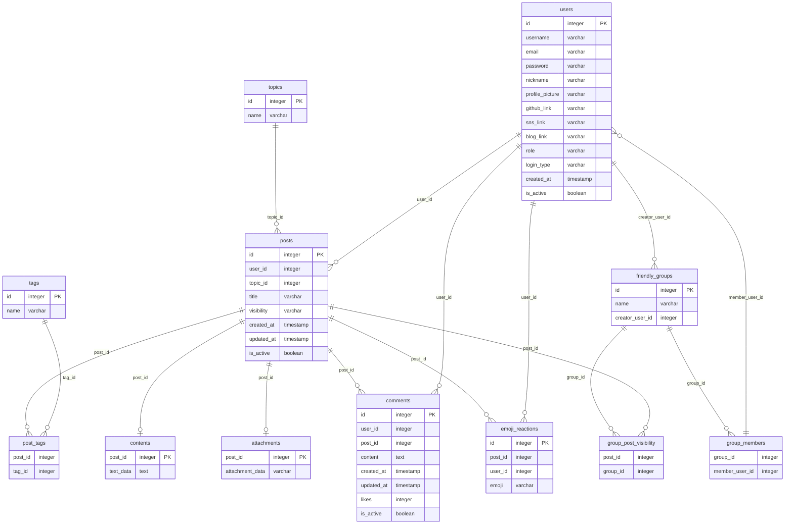

## 초기 데이터베이스 설계

### 함수 종속성(Functional Dependencies, FDs)

FD1: User -> {Username, Email, Password, Nickname, ProfilePicture, GithubLink, SnsLink, BlogLink, Role, LoginType, is_active}

FD2: Post -> {UserID, TopicID, Title, Visibility, CreatedAt, UpdatedAt, is_active}

FD3: Comment -> {UserID, PostID, Content, CreatedAt, UpdatedAt, Likes, is_active}

FD4: Topic -> {Name}

FD5: Tag -> {Name}

FD6: PostTag -> {PostID, TagID}

FD7: Content -> {TextData}

FD8: Attachment -> {AttachmentData}

FD9: Emoji_Reaction -> {PostID, UserID, Emoji}

FD10: Friendly_Group -> {Name, CreatorUserID}

FD11: GroupMember -> {GroupID, MemberUserID}

FD12: GroupPostVisibility -> {PostID, GroupID}

### 클로저(Closure)

User+ = {ID, Username, Email, Password, Nickname, ProfilePicture, GithubLink, SnsLink, BlogLink, Role, LoginType, is_active}

Post+ = {ID, UserID, TopicID, Title, Visibility, CreatedAt, UpdatedAt, is_active}

Comment+ = {ID, UserID, PostID, Content, CreatedAt, UpdatedAt, Likes, is_active}

Topic+ = {ID, Name}

Tag+ = {ID, Name}

PostTag+ = {PostID, TagID}

Content+ = {PostID, TextData}

Attachment+ = {PostID, AttachmentData}

Emoji_Reaction+ = {ID, PostID, UserID, Emoji}

Friendly_Group+ = {ID, Name, CreatorUserID}

GroupMember+ = {GroupID, MemberUserID, PK}

GroupPostVisibility+ = {PostID, GroupID, PK}

### ERD

### 릴레이션 설명

`Users Table` : 사용자의 기본 정보 및 소셜 링크와 함께 로그인 유형을 저장합니다.

`Posts Table` : 게시물의 메타데이터와 함께 게시물의 가시성(예: 공개, 개인 또는 그룹) 정보를 저장합니다.

`Topics Table `: 게시물의 주제를 분류하는 데 사용됩니다.

`Tags & PostTags Tables` : 게시물에 태그를 부여하며, PostTags는 게시물과 태그 간의 다대다 관계를 구현합니다.

`Comments Table` : 게시물에 대한 댓글 정보를 저장합니다.

`Contents & Attachments Tables` : 게시물의 본문과 관련 첨부 파일을 저장합니다.

`Emoji_Reactions Table` : 게시물에 대한 이모티콘 반응을 저장합니다.

`Friendly_Groups & GroupMembers Tables` : 사용자가 속한 그룹과 그룹의 멤버를 관리합니다.

`GroupPostVisibility Table` : 그룹에게만 표시되는 게시물을 관리합니다.

### Redis를 활용한 효율성 확보

`User`

사용자의 프로필, role, login_type 등 자주 참조되는 데이터를 캐싱하면 로그인 시나리오나 사용자 관련 피드를 더 빠르게 제공할 수 있어보임.

`Posts`

인기 있는 게시물이나 최신 게시물들을 캐싱하면 전체 페이지 로드 시간을 줄일 수 있어 보임.

`Comments`

특정 게시물에 대한 최신 댓글을 캐싱하여 댓글 로딩 시간을 줄일 수 있어보임.

`Topics & Tags`

이들은 변경 빈도가 낮을 것으로 예상되므로 Redis에서 캐싱하여 빠른 참조가 가능하게 만들 수 있어보임.

### 탈퇴시 삭제 메커니즘

탈퇴한 사용자의 데이터 처리 메커니즘

is_active 플래그를 사용하여 먼저 데이터를 UI에서 숨긴 후, 나중에 Spring Batch와 같은 배치 처리 시스템을 사용하여 정기적으로 비활성화된 데이터를 삭제. 

실시간 서비스의 성능 저하 없이 큰 양의 데이터를 안전하게 삭제할 수 있어보임.
