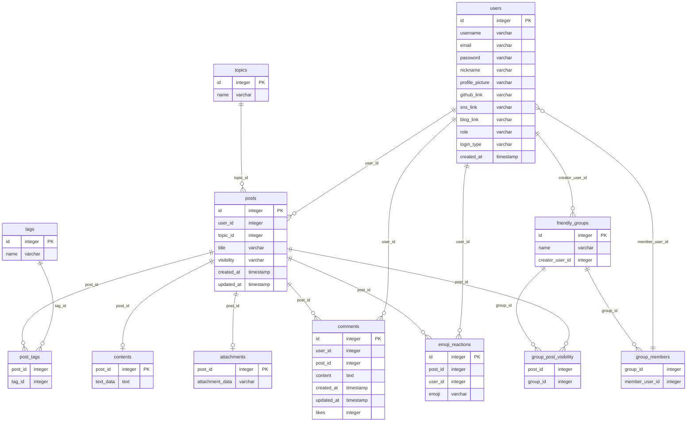

  

   

# plog_repo
>private for public 

### 주요 기능

1. 글 작성 및 조회
2. 댓글 기능
3. 이모지 반응
4. 태그 기능
5. 소셜 로그인 (Google, Kakao)
6. 프로필 편집

### 사용자 시나리오
1. 사용자는 구글 또는 카카오톡 계정으로 로그인합니다.
2. 로그인한 사용자는 대시보드에서 글을 조회하거나, 특정 토픽이나 태그로 글을 검색할 수 있습니다.
3. 사용자는 특정 글을 클릭하여 내용을 확인하고, 댓글을 작성하거나 이모지로 반응할 수 있습니다.
4. 사용자는 자신의 프로필을 편집하여 닉네임, 이메일, 프로필 사진, Github 링크, SNS 링크, 블로그 링크 등을 업데이트할 수 있습니다.
5. Admin 권한을 가진 사용자는 모든 사용자의 글을 수정/삭제할 수 있습니다.
6. 글의 공개 범위 설정(공개, 친구에게만 공개 등)이 가능합니다.
7. 친구 그룹별로 글의 공개 범위를 설정할 수 있습니다.
8. 친구 그룹에 초대 받은 사용자는 알림을 받습니다.
9. 각 사용자는 친구 그룹을 관리할 수 있습니다.
10. 글 작성 시 공개 범위를 선택하고, 친구 그룹의 공개 범위도 설정할 수 있습니다.
11. 모든 사용자는 본인이 작성 한 글만 수정, 삭제할 수 있습니다.
12. 계정을 탈퇴할 경우 comment의 유저정보는 탈퇴한 회원입니다 라고 나오며 해당 유저가 소속된 group에서 자동으로 전부 제거됩니다.
13. 계정 탈퇴시 작성한 글은 전부 삭제됩니다.

### 초기 데이터베이스 설계
**함수 종속성(Functional Dependencies, FDs)**

FD1: User -> {Username, Email, Password, Nickname, ProfilePicture, GithubLink, SnsLink, BlogLink, Role, LoginType}

FD2: Post -> {UserID, TopicID, Title, Visibility, CreatedAt, UpdatedAt}

FD3: Comment -> {UserID, PostID, Content, CreatedAt, UpdatedAt, Likes}

FD4: Topic -> {Name}

FD5: Tag -> {Name}

FD6: PostTag -> {PostID, TagID}

FD7: Content -> {TextData}

FD8: Attachment -> {AttachmentData}

FD9: Emoji_Reaction -> {PostID, UserID, Emoji}

FD10: Friendly_Group -> {Name, CreatorUserID}

FD11: GroupMember -> {GroupID, MemberUserID}

FD12: GroupPostVisibility -> {PostID, GroupID}

**클로저(Closure)**

User+ = {ID, Username, Email, Password, Nickname, ProfilePicture, GithubLink, SnsLink, BlogLink, Role, LoginType}

Post+ = {ID, UserID, TopicID, Title, Visibility, CreatedAt, UpdatedAt}

Comment+ = {ID, UserID, PostID, Content, CreatedAt, UpdatedAt, Likes}

Topic+ = {ID, Name}

Tag+ = {ID, Name}

PostTag+ = {PostID, TagID}

Content+ = {PostID, TextData}

Attachment+ = {PostID, AttachmentData}

Emoji_Reaction+ = {ID, PostID, UserID, Emoji}

Friendly_Group+ = {ID, Name, CreatorUserID}

GroupMember+ = {GroupID, MemberUserID}

GroupPostVisibility+ = {PostID, GroupID}

**ERD**

**릴8레이션 설명**

`Users Table` : 사용자의 기본 정보 및 소셜 링크와 함께 로그인 유형을 저장합니다.
`Posts Table` : 게시물의 메타데이터와 함께 게시물의 가시성(예: 공개, 개인 또는 그룹) 정보를 저장합니다.
`Topics Table `: 게시물의 주제를 분류하는 데 사용됩니다.
`Tags & PostTags Tables` : 게시물에 태그를 부여하며, PostTags는 게시물과 태그 간의 다대다 관계를 구현합니다.
`Comments Table` : 게시물에 대한 댓글 정보를 저장합니다.
`Contents & Attachments Tables` : 게시물의 본문과 관련 첨부 파일을 저장합니다.
`Emoji_Reactions Table` : 게시물에 대한 이모티콘 반응을 저장합니다.
`Friendly_Groups & GroupMembers Tables` : 사용자가 속한 그룹과 그룹의 멤버를 관리합니다.
`GroupPostVisibility Table` : 그룹에게만 표시되는 게시물을 관리합니다.